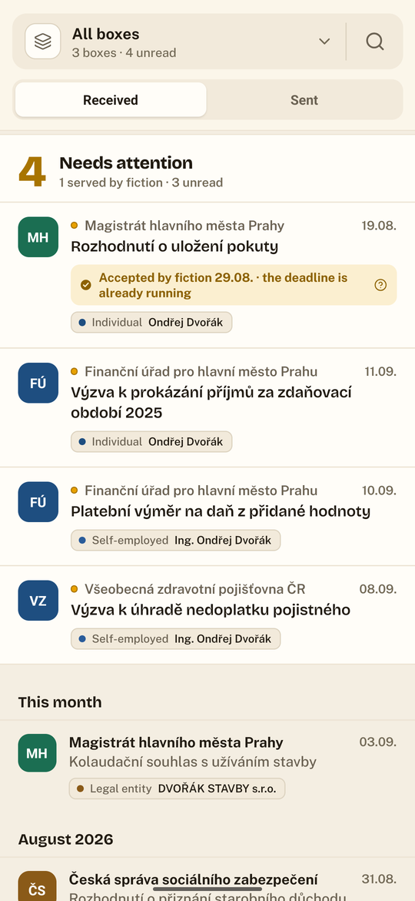
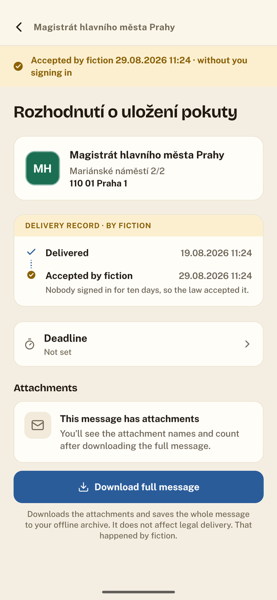
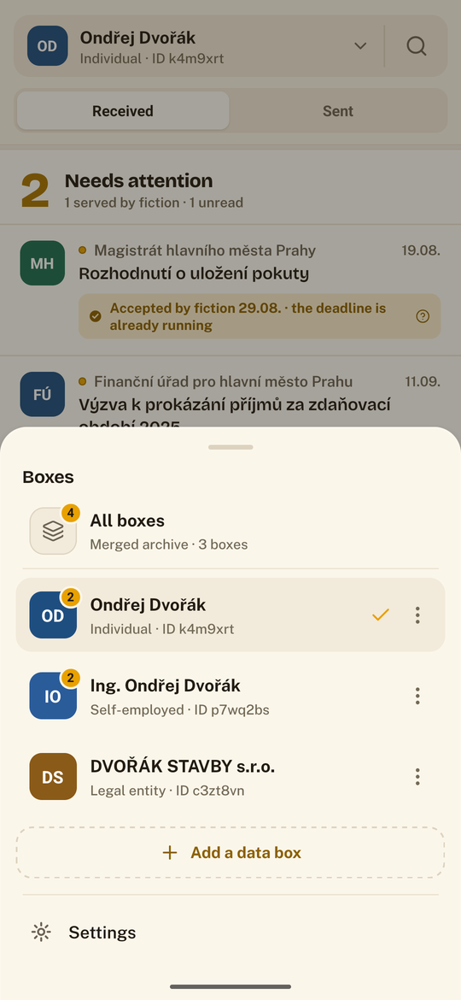
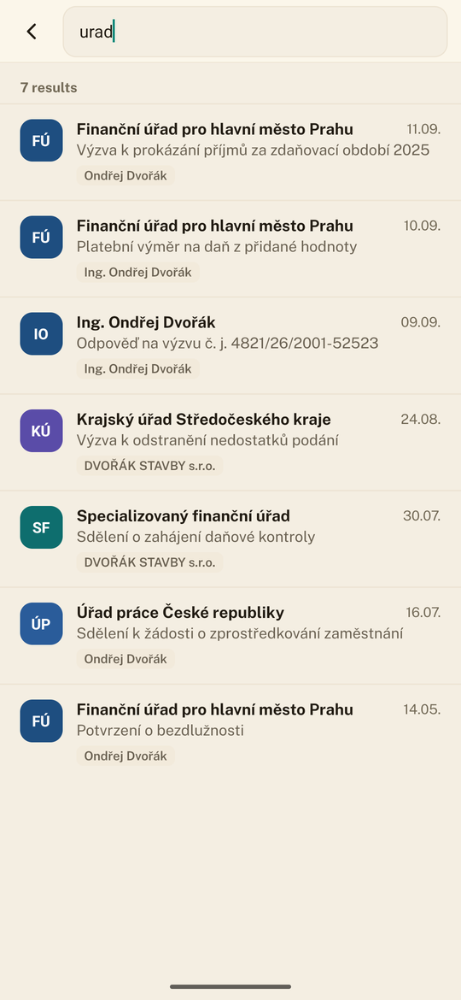
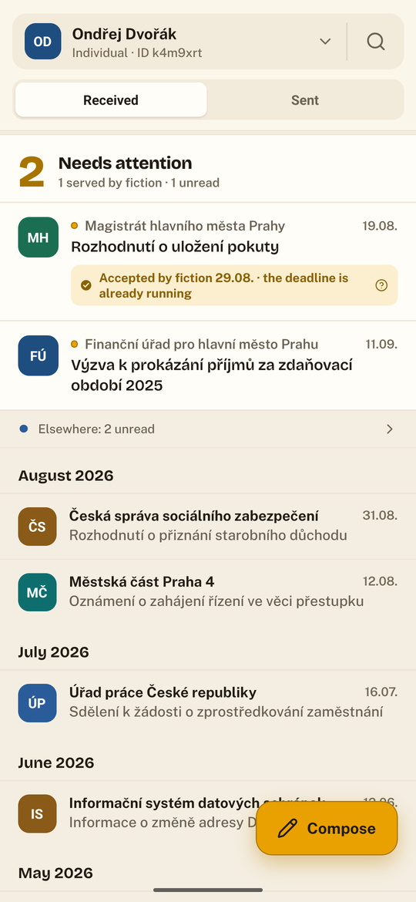
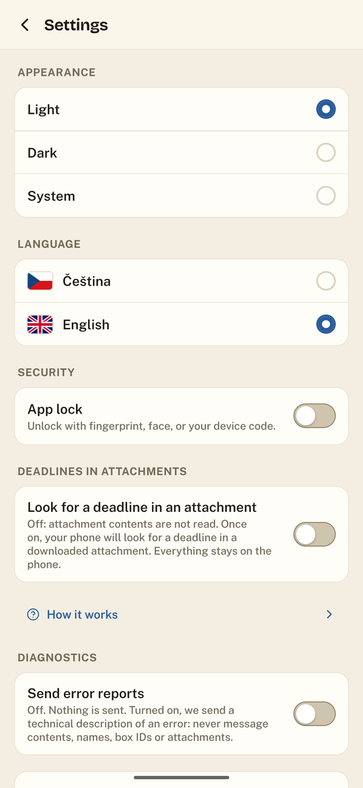
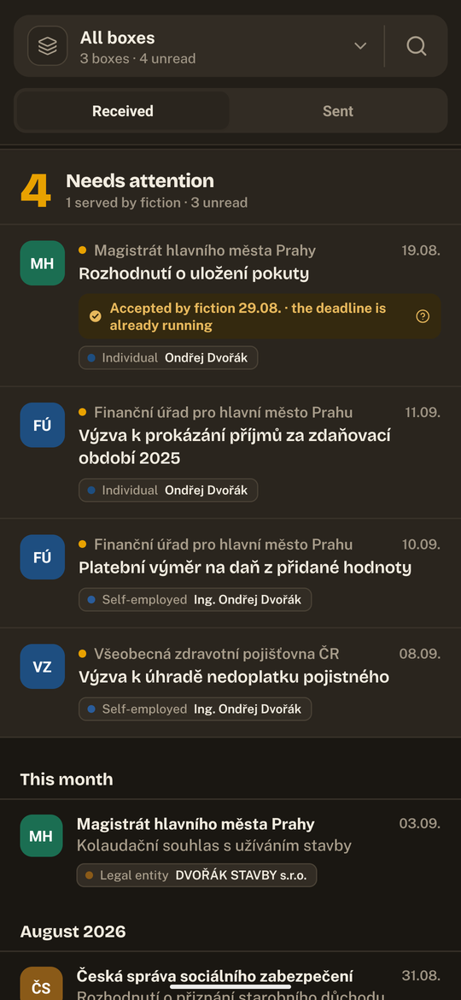
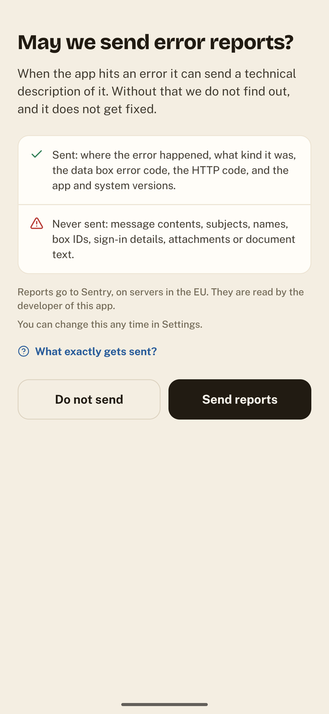

<div align="center">

<br>
<br>

<h1><br>Obálka</h1>

### Your government mail: clear, secure and stress-free.

A Czech data-box (datová schránka) client for Android and iOS.
Government mail that reads like mail, and an archive that does not vanish after ninety days.

[](LICENSE)
[](#installing-and-developing)
[](#built-with-ai)
[](package.json)
[](https://github.com/Dorhawk-Software/obalka/actions/workflows/ci.yml)
[](#project-status)

[Česky](README.md) · **English**



</div>

---

## Why

A Czech data box is a legal delivery address. It tends to be treated worse than a marketing email.

**Message content expires.** ISDS keeps a message for 90 days after delivery and then removes it
from its servers. An attachment you did not download in time is gone for good. A decision, a tax
assessment, a court order: gone.

**Not signing in is not a defence.** After ten days a message is served by legal fiction
(§ 17(4) of Act 300/2008 Coll.) whether you signed in or not. Deadlines run. Your appeal window runs.

**People usually have more than one box.** A private person, a sole trader, a company. Three boxes,
three sign-ins, three places you must not forget to check.

Obálka answers all three. It downloads and **permanently keeps** envelopes and attachments in an
encrypted archive on the phone, shows **one unified inbox** across every account, and **counts the
deadlines** before they run out.

---

## What it looks like

<div align="center">

| Unified inbox | Delivery record | Box switcher |
|:---:|:---:|:---:|
|  |  |  |
| Every box in one list. A chip on each message says which box it arrived in. | What happened, and when. A step appears only for something that actually happened. | Unread counts per box. "All" is visibly not just another box. |

| Search | A single box | Settings |
|:---:|:---:|:---:|
|  |  |  |
| Across every box, in the local archive, with no connection. | An "Elsewhere" line says something is waiting in another box without stealing attention. | Appearance, language, lock, deadlines, diagnostics. |

<br>

**Light and dark, independent of the phone's own setting.**

 

<sub>Every piece of data in these screenshots is invented (<code>src/dev/demoData.ts</code>). The
names, box IDs, case numbers and addresses are all fictional.</sub>

</div>

---

## What it does

### An archive that does not expire

Every downloaded message stays on the phone after ISDS deletes it. The archive holds the envelope
(sender, recipient, subject, delivery and service times), every downloaded attachment, and the
message's **signed original** (a .zfo file) you can save or share at any time. It is an **encrypted
database** (SQLCipher); the key lives in the device's secure storage.

### A unified inbox

One list across every account, the way email works. Each message carries a chip naming the box it
arrived in. If you only have one box, the unified view is not offered at all.

### Deadlines and the delivery fiction

A **Needs attention** section shows what is closing in: unread messages and the ten-day clock. When
a message was served by fiction, the app says so plainly and explains why.

Optionally, and **only inside a file already downloaded to the phone**, Obálka can look for a
deadline in an attachment. Leave it off and attachment contents are never read at all.

### The delivery record

A record, not a timeline. A step appears **only for something that actually happened**: nothing is
greyed in as "still to come", and no step borrows another's timestamp. Opening a message is not a
step, because legally it changes nothing.

### Sending

Data messages to public authorities (free) and postal data messages to private boxes (paid, with the
PDZ credit shown up front). You see the full addressee, address included, before anything is sent.

### Search

Across every box, over the local archive, offline.

---

## Privacy

This is a client for your mail from the state. It is built accordingly.

**We have no server.** There is no backend for your mail, your credentials or anything else to go to.
The app talks to ISDS, and elsewhere only in two cases you decide on: crash reports (only with your
consent), and moving the archive to another phone, which may connect through croc's public relay,
encrypted so the relay cannot read it.

**It does not sync in the background.** At all. The ISDS operating rules require an application on a
local workstation to sign in only *"by a manual command of the user"* - and note that **merely
listing your messages is legal service** (§ 17(3)). An app that checks your box in the background is
delivering your mail without your knowledge and starting legal deadlines. Obálka does not do that.

**App lock.** Optional: fingerprint, face or device passcode. When it is on, it locks the saved
passwords and sign-ins too - until you unlock, not even the app can read them. On top of that, the
contents never appear in the app switcher, nor in the snapshot the system writes to disk.

**Encrypted backup.** The whole archive, downloaded attachments included, encrypted with a key only the
user holds (Argon2id + XChaCha20-Poly1305, attachments with AES-256-GCM). Without it nobody opens that
backup, including us. The archive can also move straight to a new phone with a one-time phrase or QR code.

**Found a security problem?** Please do not report it publicly — [`SECURITY.md`](SECURITY.md) says how.

<div align="center"></div>

**Crash reports ask first.** What is sent: where the error happened and what it was. What is never
sent: message contents, subjects, names, box IDs, credentials, attachments or document text. EU
servers, and switchable off at any time.

**Debug mode uploads nothing by itself.** It records a technical trace into a file on the phone;
you share that file, with whoever you choose, and the app never learns that you did.

---

## Built with

| | |
|---|---|
| **App** | React Native 0.86, New Architecture (Fabric + TurboModules), Hermes |
| **Language** | TypeScript, `strict` |
| **UI** | Tamagui, a custom "paper" design system, Reanimated, Gesture Handler |
| **Storage** | SQLCipher via op-sqlite (encrypted database), Keychain / Keystore for keys |
| **Crypto** | Argon2id, XChaCha20-Poly1305 and AES-256-GCM (backups) |
| **Transfer** | croc (Go via gomobile), Android for now |
| **ISDS** | SOAP over HTTPS, a hand-written client, per-box session isolation |
| **Languages** | Czech, English |

---

## Installing and developing

```bash
npm ci
npm start                 # Metro

npm run android           # Android (JDK 17)
npm run ios               # iOS (macOS + Xcode)
```

For an emulator it is worth building a single architecture:

```bash
cd android && ./gradlew assembleDebug -PreactNativeArchitectures=x86_64
```

The checks CI runs, in one command (CI also runs a secret scan, `npm run audit:secrets`, which needs
Trivy installed):

```bash
npm run verify            # typecheck, lint, tests, attributions, dependency audit, palette
```

- **iOS tooling:** CocoaPods, installed through the `Gemfile`, needs Ruby 3.1 or later; the macOS system Ruby is too old.
- **Minimum iOS is 15.5** (`VisionCameraBarcodeScanner`, the QR reader, goes no lower); Android 7.0 (API 24).
- **iOS without a Mac:** `docs/sideload-ios-linux.md` (an unsigned IPA from GitHub Actions + iloader).
- **Test environment:** development runs against czebox, never against live boxes.

---

## Quality

**Tests, a typecheck and a lint** run on every push and all have to pass. CI adds more checks: that
the licence attributions are current, that no vulnerable dependency reached the app, that no screen
hard-codes a colour outside the palette, that no credential was committed by accident, and that the
app still compiles for iOS.

Some of those tests guard decisions rather than behaviour: that diagnostics switched off never
transmit, that message contents cannot reach a crash report, that a row which opens something draws
the mark that says so, or that the app-switcher protection does not quietly revert to `FLAG_SECURE`,
which would take the user's own screenshots away.

---

## Project status

**Version 0.0.1, before the first beta.** Done and walked on a device: accounts and sign-in, messages
and attachments, the local archive and search, sending, deadlines and the fiction, the delivery
record, appearance and languages, per-box session isolation, the unified inbox, debug mode and the
app lock. Done, but not yet walked on a device: keeping each message's signed original.

Also done: the **encrypted backup**, attachments and restore included, with a recovery key that can be
shown and scanned as a QR code, and a **phone-to-phone transfer** with a one-time phrase (Android for
now). Planned for later: backing up to the cloud (Google Drive, iCloud), and the transfer on iPhone.

An honest per-feature breakdown, including what is **not** done, lives in
[`specs/README.md`](specs/README.md).

---

## Built with AI

Obálka was written in large part by AI, specifically [Claude](https://claude.ai) by Anthropic. Stated
here plainly and without embarrassment: without that help the app would not exist, or it would have
taken years. We are grateful for it and see no reason to hide it.

What that means in practice:

- **A human decides what gets built and what ships.** The AI is a tool, not the author of the
  product. Every feature has a specification in [`specs/`](specs/), and anything unfinished is
  written down there as unfinished.
- **Nothing ships because it looks finished.** Tests, a typecheck, a lint and more checks in CI. The things that matter are also walked on a real device, because a class of bug no test
  sees: an invisible placeholder, text clipped at a larger font size, the inbox showing in the app
  switcher.
- **Decisions are written down, not just made.** The comments explain why, especially where the code
  looks needlessly complicated: why the delivery record is a record and not a timeline, why the app
  refuses to sync in the background at all, why the app-switcher protection must not reach for
  `FLAG_SECURE`.

A bug in the app belongs to the people who released it. That an AI helped is not an excuse, and is
not used as one here.

---

## Licence

[MIT](LICENSE). Obálka is an independent data-box client. It is not an official application of the
Ministry of the Interior or of the ISDS operator, and is not affiliated with either.

<div align="center">
<br>
<sub>Built for people who get mail from the state that they cannot afford to miss.</sub>
</div>
