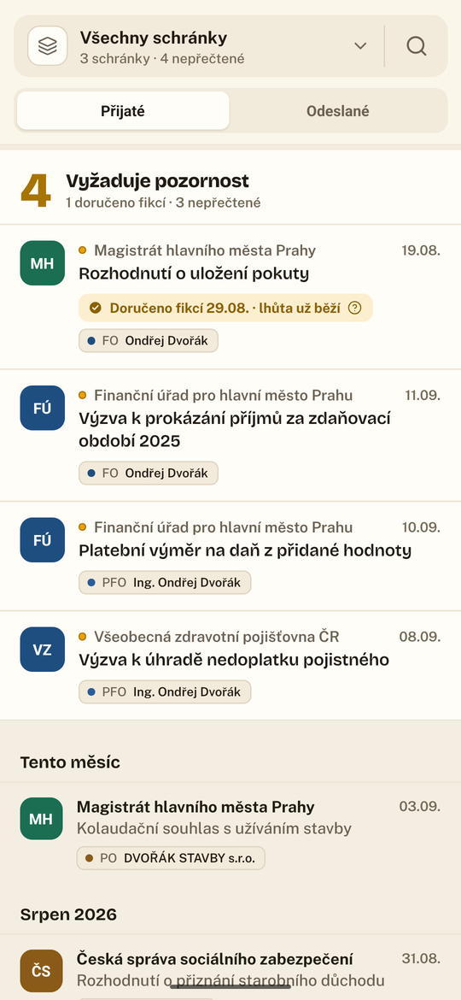
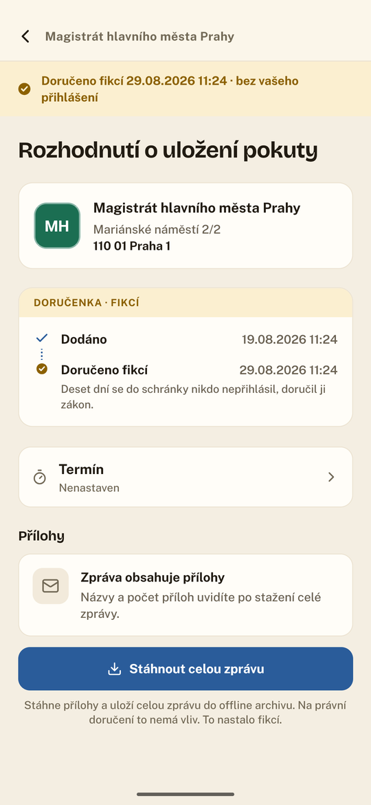
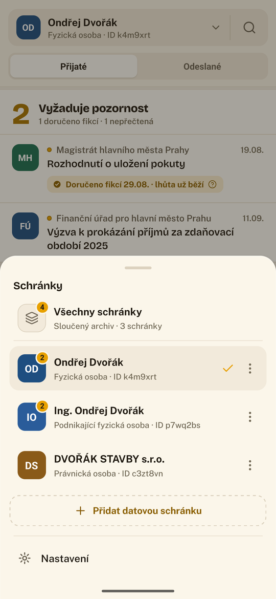
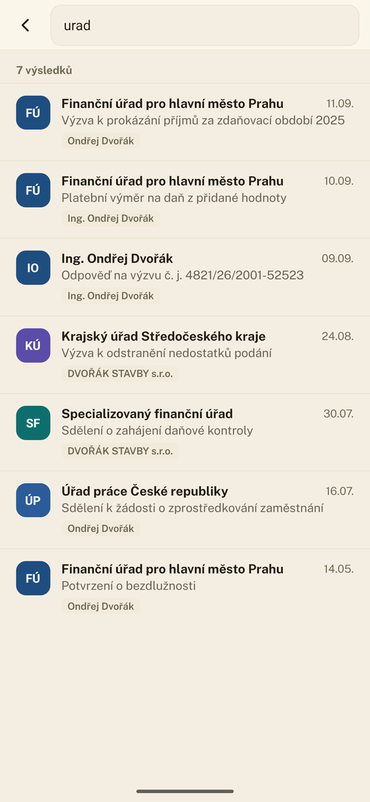
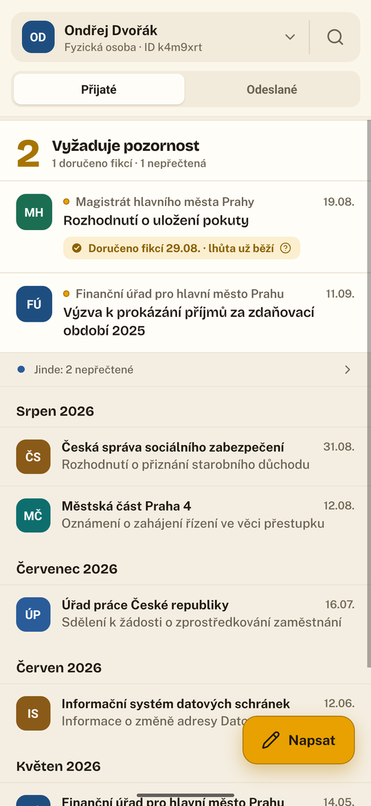
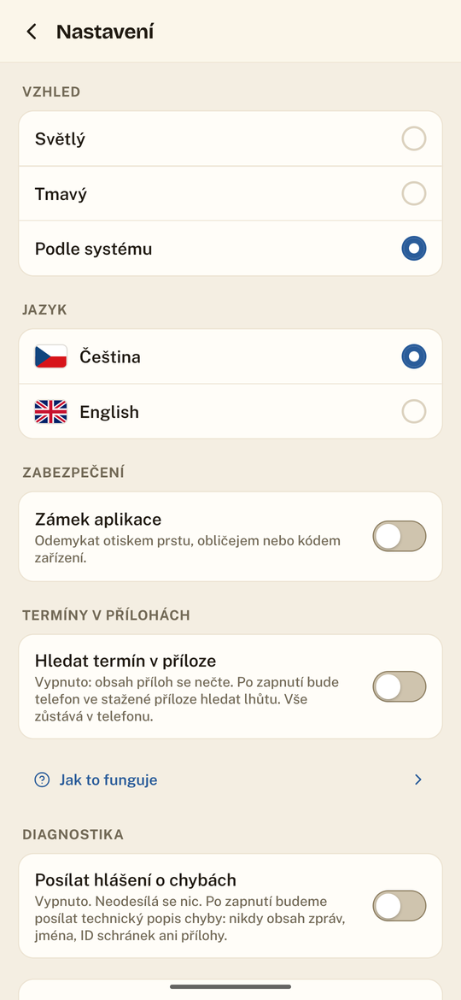
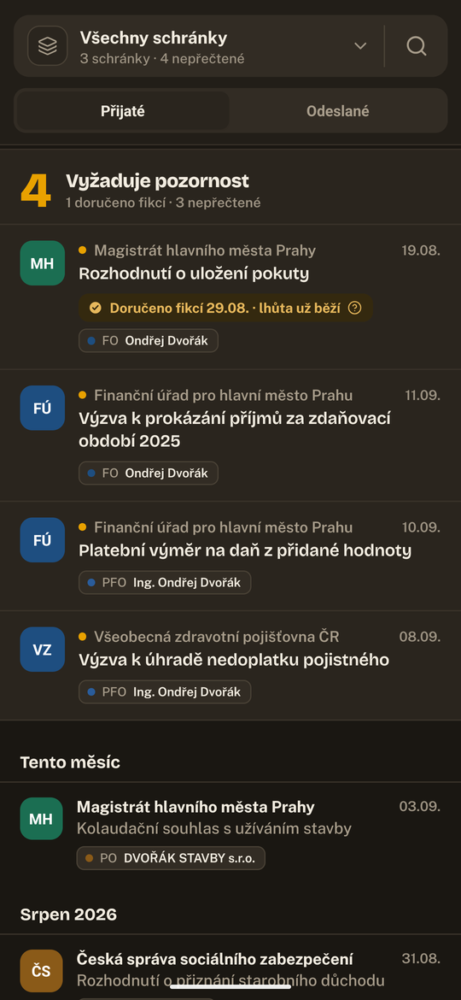
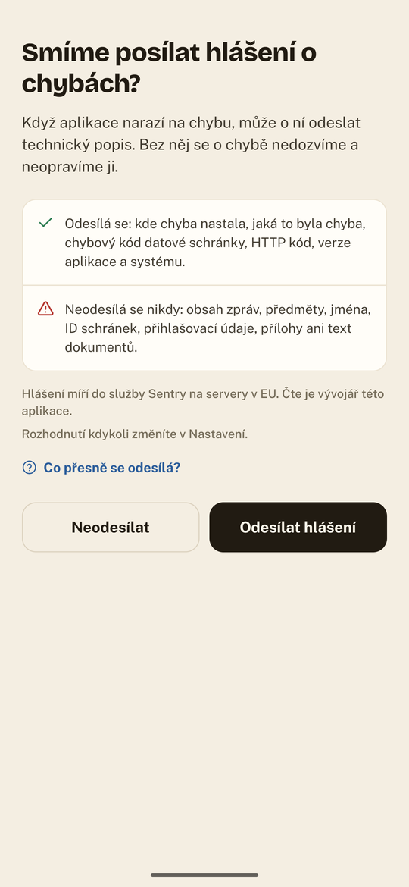

<div align="center">

<br>
<br>

<h1><br>Obálka</h1>

### Vaše státní pošta: přehledně, bezpečně a bez stresu.

Klient datových schránek pro Android a iOS.
Pošta od úřadů, která se čte jako pošta, a archiv, který nezmizí za devadesát dní.

[](LICENSE)
[](#instalace-a-v%C3%BDvoj)
[](#postaveno-s-ai)
[](package.json)
[](https://github.com/Dorhawk-Software/obalka/actions/workflows/ci.yml)
[](#stav-projektu)

**Česky** · [English](README.en.md)



</div>

---

## Proč

Datová schránka je ze zákona doručovací adresa. Zachází se s ní přitom hůř než s reklamním e‑mailem.

**Obsah zpráv mizí.** ISDS uchovává zprávu 90 dnů od doručení a pak ji ze svých serverů odstraní.
Přílohu, kterou jste si nestáhli včas, už z ní nikdy nedostanete. Rozhodnutí, platební výměr,
usnesení soudu: pryč.

**Nepřihlásit se není obrana.** Po deseti dnech je zpráva doručena fikcí (§ 17 odst. 4 zákona
300/2008 Sb.), ať jste se přihlásili nebo ne. Lhůty běží. Termín na odvolání běží.

**Schránek bývá víc než jedna.** Fyzická osoba, podnikající fyzická osoba, s.r.o. Tři schránky,
tři přihlášení, tři místa, kam se nezapomenout podívat.

Obálka řeší všechny tři. Stahuje a **trvale uchovává** obálky i přílohy do šifrovaného archivu
v telefonu, ukazuje **jednu sloučenou schránku** přes všechny účty a **počítá lhůty** dřív, než
uplynou.

---

## Jak to vypadá

<div align="center">

| Sloučená schránka | Doručenka | Přepínač schránek |
|:---:|:---:|:---:|
|  |  |  |
| Všechny schránky v jednom seznamu. Štítek u každé zprávy říká, kam přišla. | Co se stalo a kdy. Krok se zobrazí jen pro to, co se skutečně stalo. | Nepřečtené u každé schránky. „Vše“ je vidět, že je něco jiného než schránka. |

| Hledání | Jedna schránka | Nastavení |
|:---:|:---:|:---:|
|  |  |  |
| Napříč všemi schránkami, v místním archivu, bez připojení. | Řádek „Jinde“ řekne, že něco leží i jinde, aniž by odvedl pozornost. | Vzhled, jazyk, zámek, termíny, diagnostika. |

<br>

**Světlý i tmavý motiv, nezávisle na nastavení telefonu.**

 

<sub>Všechna data na snímcích jsou vymyšlená (<code>src/dev/demoData.ts</code>). Jména, IDs schránek,
spisové značky i adresy jsou smyšlené.</sub>

</div>

---

## Co umí

### Archiv, který nemizí

Každá stažená zpráva zůstává v telefonu i poté, co ji ISDS smaže. Archiv drží obálku (odesílatele,
příjemce, předmět, čas dodání i doručení), všechny stažené přílohy a **podepsaný originál zprávy**
(soubor .zfo), který jde kdykoli uložit nebo poslat dál. Je to **šifrovaná databáze** (SQLCipher),
klíč leží v zabezpečeném úložišti zařízení.

### Sloučená schránka

Jeden seznam přes všechny účty, jako v e‑mailu. U každé zprávy je štítek se schránkou, do které
přišla. Pokud máte schránku jen jednu, sloučený pohled se vůbec nenabízí.

### Termíny a fikce doručení

Sekce **Vyžaduje pozornost** ukazuje, co se blíží: nepřečtené zprávy a běžící desetidenní lhůta.
U zprávy doručené fikcí to aplikace řekne rovnou a vysvětlí proč.

Volitelně a **jen ve staženém souboru přímo v telefonu** umí Obálka hledat termín v příloze. Bez
zapnutí se obsah příloh vůbec nečte.

### Doručenka

Záznam o doručení, ne časová osa. Krok se zobrazí **jen pro to, co se skutečně stalo**: nic se
nedokresluje našedle jako „přijde“, žádný krok si nepůjčuje cizí čas. Otevření zprávy není krok,
protože právně nic nemění.

### Odesílání

Datové zprávy úřadům (zdarma) i poštovní datové zprávy soukromým schránkám (placené, s kreditem
PDZ viditelným předem). Adresáta vidíte celého, včetně adresy, než odešlete.

### Hledání

Napříč všemi schránkami, nad místním archivem, bez připojení.

---

## Soukromí

Tohle je klient vaší pošty od státu. Podle toho je postavený.

**Nemáme žádný server.** Neexistuje backend, kam by šla vaše pošta, přihlašovací údaje nebo cokoliv
jiného. Aplikace mluví s ISDS a jinam jen ve dvou případech, o kterých rozhodujete vy: hlášení o chybách
(jen se souhlasem) a přenos archivu do jiného telefonu, který se může spojit přes veřejný relay nástroje
croc – zašifrovaně, relay obsah nepřečte.

**Nesynchronizuje se na pozadí.** Vůbec. Provozní řád ISDS vyžaduje, aby se aplikace na místní
stanici přihlašovala pouze *„pomocí manuálního příkazu uživatele“* - a pozor, **samotné vypsání
seznamu zpráv je právní doručení** (§ 17 odst. 3). Aplikace, která kontroluje schránku na pozadí,
vám doručuje poštu bez vašeho vědomí a spouští lhůty. Obálka to nedělá.

**Zámek aplikace.** Volitelný: otisk, obličej nebo kód zařízení. Když je zapnutý, zamyká i uložená
hesla a přihlášení ke schránkám – dokud aplikaci neodemknete, nepřečte je ani ona sama. Obsah se navíc
nikdy neobjeví v přepínači aplikací ani ve snímku, který si systém ukládá na disk.

**Šifrovaná záloha.** Celý archiv včetně stažených příloh, zašifrovaný heslem, které má jen uživatel
(Argon2id + XChaCha20‑Poly1305, přílohy AES‑256‑GCM). Bez něj zálohu neotevře nikdo, ani my. Do nového
telefonu se archiv dá přenést i přímo, přes jednorázovou frázi nebo QR kód.

**Našli jste bezpečnostní chybu?** Nehlaste ji veřejně — postup je v [`SECURITY.md`](SECURITY.md).

<div align="center"></div>

**Hlášení o chybách se ptají předem.** Odesílá se, kde chyba nastala a jaká byla. Neodesílá se
nikdy obsah zpráv, předměty, jména, ID schránek, přihlašovací údaje, přílohy ani text dokumentů.
Servery v EU, vypnutelné kdykoliv.

**Režim ladění nic neodesílá sám.** Zaznamená technický průběh do souboru v telefonu; ten sdílíte
vy, komu chcete, a aplikace se nedozví, že jste to udělali.

---

## Technologie

| | |
|---|---|
| **Aplikace** | React Native 0.86, New Architecture (Fabric + TurboModules), Hermes |
| **Jazyk** | TypeScript, `strict` |
| **UI** | Tamagui, vlastní „paper“ design systém, Reanimated, Gesture Handler |
| **Úložiště** | SQLCipher přes op-sqlite (šifrovaná databáze), Keychain / Keystore na klíče |
| **Kryptografie** | Argon2id, XChaCha20‑Poly1305 a AES‑256‑GCM (zálohy) |
| **Přenos** | croc (Go přes gomobile), Android i iOS |
| **ISDS** | SOAP přes HTTPS, vlastní klient, izolace session po schránkách |
| **Jazyky** | Čeština, angličtina |

---

## Instalace a vývoj

```bash
npm ci
npm start                 # Metro

npm run android           # Android (JDK 17)
npm run ios               # iOS (macOS + Xcode)
```

Pro emulátor se hodí sestavit jen jednu architekturu:

```bash
cd android && ./gradlew assembleDebug -PreactNativeArchitectures=x86_64
```

Testy a kontroly, které pouští i CI:

```bash
npm run verify            # typecheck, lint, testy, atribuce, audit závislostí, paleta
```

- **Nástroje pro iOS:** CocoaPods přes `Gemfile` potřebuje Ruby 3.1 nebo novější; systémové Ruby v macOS nestačí.
- **Minimální iOS je 15.5** (vynutila ho dřívější čtečka QR kódů postavená na ML Kit; ta už v aplikaci není, hranice zůstala); Android 7.0 (API 24).
- **Čtení QR kódů bez ML Kit:** iOS používá systémový `AVCaptureMetadataOutput` (přes jádro VisionCamera), Android zxing-cpp (`react-native-nitro-zxing`). Obojí běží jen v telefonu a nic nikam neposílá.
- **Přenos do jiného telefonu** potřebuje knihovnu v Go, kterou běžné sestavení nevyrábí: `scripts/build-transfer-aar.sh` (Android; Go, JDK, Android SDK a NDK) a `scripts/build-transfer-xcframework.sh` (iOS, jen na macOS; potom znovu `pod install`). Bez ní aplikace funguje, jen přenos nenabídne; CI a vydání ji sestavují samy (`docs/release-ci.md`).
- **iOS bez Macu:** `docs/sideload-ios-linux.md` (nepodepsaná IPA z GitHub Actions + iloader).
- **Testovací prostředí:** vývoj běží proti czebox, ne proti ostrým schránkám.

---

## Kvalita

**Testy, typecheck a lint** běží na každý push a musí projít. CI k nim přidává další kontroly: že jsou
licenční atribuce aktuální, že se do aplikace nedostala zranitelná závislost, že v obrazovkách
nejsou natvrdo psané barvy mimo paletu, že v repozitáři neleží omylem uložený přístupový klíč a že se
aplikace přeloží i pro iOS.

Část testů nehlídá chování, ale rozhodnutí: že se vypnutá diagnostika nikdy neodešle, že se do
hlášení nedostane obsah zprávy, že řádek, který někam vede, kreslí šipku, nebo že se ochrana
přepínače aplikací nevrátí k `FLAG_SECURE`, které by uživateli vzalo snímky obrazovky.

---

## Stav projektu

**Před první beta verzí.** Hotové a odzkoušené na zařízení: účty a přihlášení,
zprávy a přílohy, místní archiv a hledání, odesílání, termíny a fikce, doručenka, vzhled a jazyky
a izolace session po schránkách, sloučená schránka, režim ladění a zámek aplikace. Hotové, ale na
zařízení zatím neprojité: ukládání podepsaných originálů zpráv.

Hotová je i **šifrovaná záloha** včetně příloh a obnovy, s heslem, které se dá zobrazit i naskenovat jako
QR kód, a **přenos do jiného telefonu** přes jednorázovou frázi, i mezi iPhonem a Androidem. Na později
zůstává zálohování do cloudu (Google Drive, iCloud).

Poctivý přehled po jednotlivých funkcích, včetně toho, co hotové **není**, je v
[`specs/README.md`](specs/README.md).

---

## Postaveno s AI

Obálku z velké části napsala umělá inteligence, konkrétně [Claude](https://claude.ai) od Anthropicu.
Je to tu napsané rovnou a bez rozpaků: bez té pomoci by aplikace nevznikla, nebo by na ni padly roky.
Jsme za ni vděční a není důvod to skrývat.

Co to znamená v praxi:

- **Co se staví a co se pustí ven, rozhoduje člověk.** AI je nástroj, ne autor produktu. Každá funkce
  má svoji specifikaci v [`specs/`](specs/), a co není hotové, je tam napsané jako nehotové.
- **Nic nejde ven jen proto, že to vypadá hotově.** Testy, typecheck, lint a další kontroly v CI. Klíčové věci se navíc procházejí na skutečném zařízení, protože část chyb žádný test nevidí:
  neviditelný placeholder, oříznutý text při větším písmu, obsah schránky v přepínači aplikací.
- **Rozhodnutí jsou zapsaná, ne jen udělaná.** Komentáře v kódu vysvětlují proč, hlavně u věcí, které
  vypadají jako zbytečná komplikace: proč je doručenka záznam a ne časová osa, proč se aplikace
  zásadně nesynchronizuje na pozadí, proč ochrana přepínače aplikací nesmí sáhnout po `FLAG_SECURE`.

Chyba v aplikaci jde za lidmi, kteří ji vydali. To, že u toho pomáhala AI, není omluva a jako omluva
se tu nepoužívá.

---

## Podpora

Obálka je a zůstane zdarma a s otevřeným kódem. Pokud vám ušetřila starosti a chcete poděkovat, můžete
vývojářům [koupit kafe](https://buymeacoffee.com/software.dorhawk). Nic se tím neodemyká – je to poděkování, ne předplatné.

---

## Licence

[MIT](LICENSE). Obálka je nezávislý klient datových schránek. Není to oficiální aplikace
Ministerstva vnitra ani provozovatele ISDS a není s nimi nijak spojena.

<div align="center">
<br>
<sub>Postaveno pro lidi, kterým chodí od státu pošta, kterou nesmí přehlédnout.</sub>
</div>
